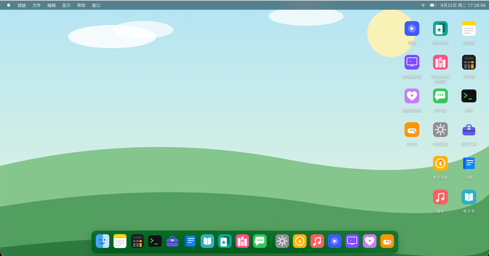
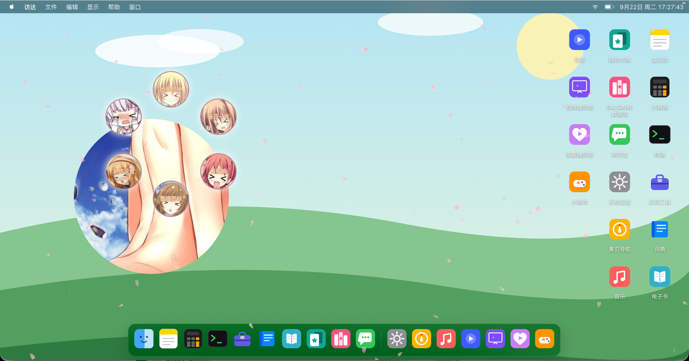
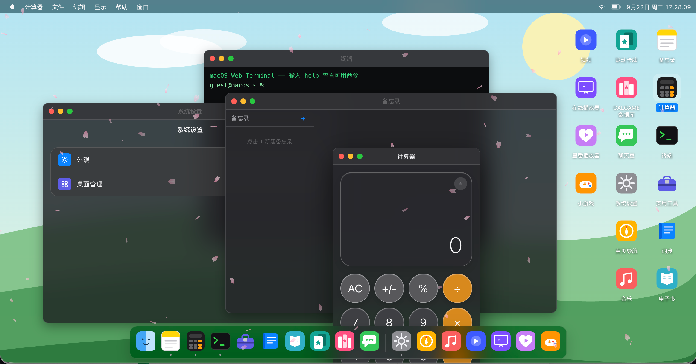
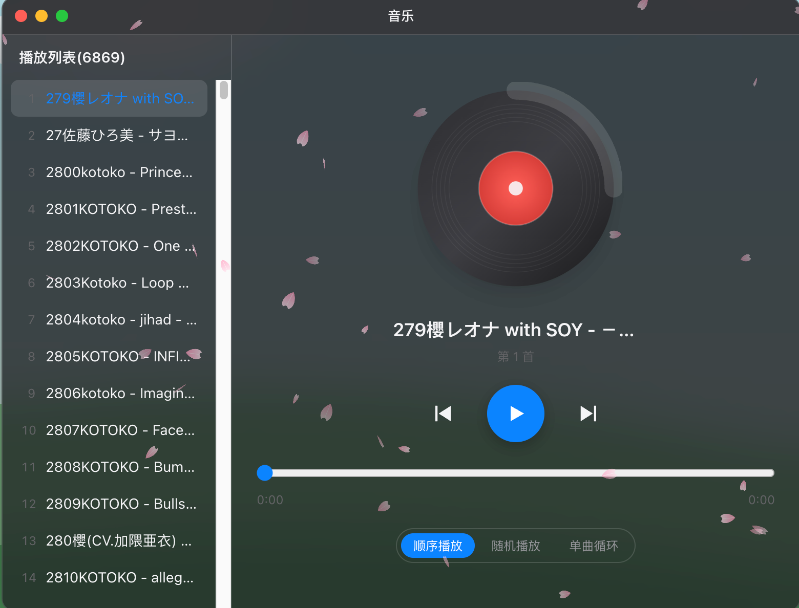
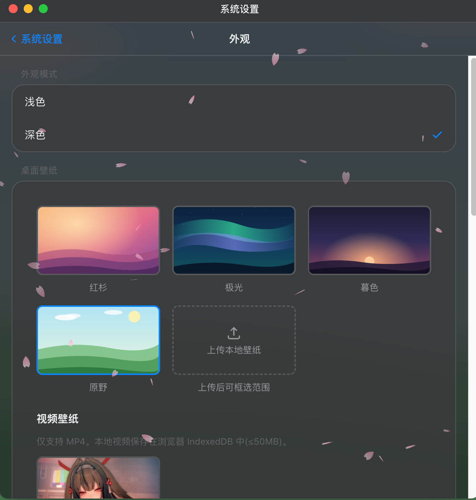
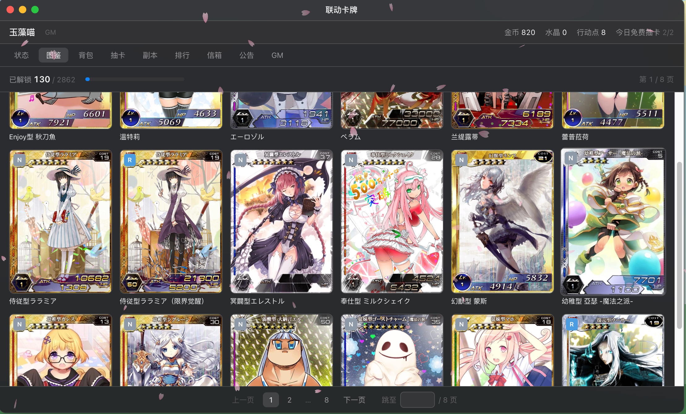
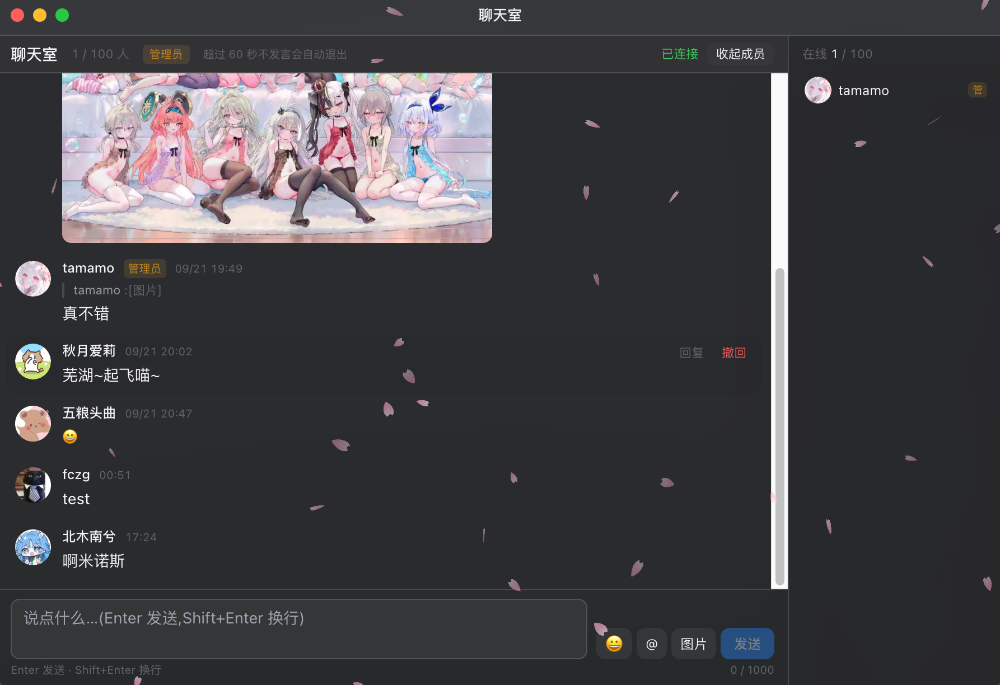
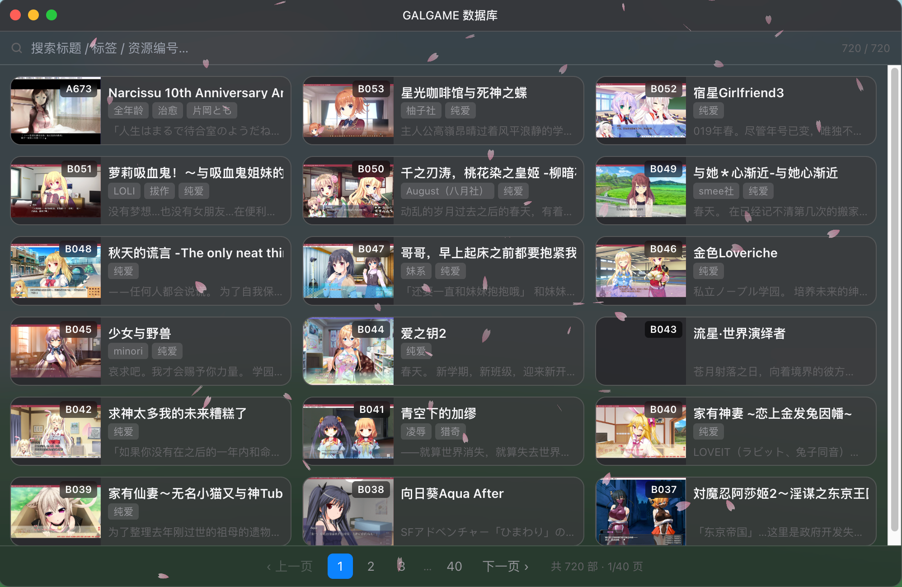
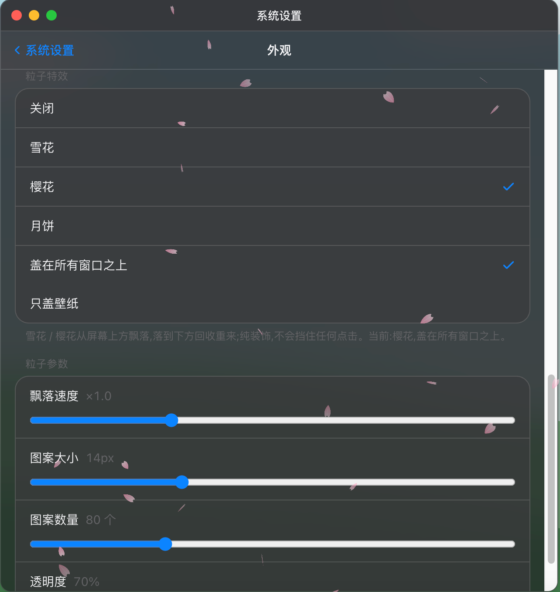

# macOS Web

**A macOS desktop, rebuilt in the browser** — windows, Dock, menu bar, a right-click ring menu, a spotlight, falling
particles, and **20 app modules** (card collecting / realtime chat / a GALGAME database / media playback / e-books /
dictionaries / mini games…).

**Visit:[macos.sakyubasu.moe](https://macos.sakyubasu.moe)**

[中文](./README.md) · **English**

---

## Desktop experience

**A macOS desktop running in your browser** — not a static mock-up. Windows really drag and resize, apps really open
and talk to a backend, data really lives in the cloud, and accounts really log in and check in daily.

| Feature | What it does |
| --- | --- |
| **Window system** | Drag, 8-way resize, minimize to Dock, maximize, click-to-focus, animated open / close / minimize / restore, one window per app by default |
| **Menu bar** | Current app name with a dropdown (About / Settings) on the left, system status and clock on the right |
| **Dock** | App icons with running indicators; click to open, click again to minimize, restore flies back to where it came from |
| **Desktop icons** | Free dragging with grid snapping, one-click "tidy up", per-app show/hide (desktop and Dock together) |
| **Themes & wallpapers** | Light/dark themes; wallpapers can be **built-in images, your own image, or your own video**, with adjustable brightness |
| **Right-click ring menu** | Right-click the desktop to fan out **circular buttons** around the cursor (widgets, tidy up, Settings, Finder…). Close with another right-click, Esc, or clicking outside |
| **Right-click spotlight** | Hold right-click to reveal artwork beneath the desktop through a **circular mask** that follows the cursor; the **scroll wheel temporarily resizes** it |
| **Falling particles** | **Snowflakes / cherry blossoms / mooncakes**, with adjustable speed, size, count and opacity; layer above all windows or wallpaper-only |
| **Desktop widgets** | Draggable, closable desktop cards, added from the ring menu |

## Built-in apps (20 modules)

**17** are directly openable from the desktop / Dock; **3** are child windows (player, video detail, work detail)
opened from their parent app.

> "Online player" and "Hentai player" are **hidden by default** — enable them in **Settings → Desktop → App visibility**.

### Productivity & tools (8)

| App | What it does |
| --- | --- |
| **Finder** | The account hub: sign up / sign in / forgot password (email codes), profile card (avatar, username, QQ, email, **points**), profile editing, **daily check-in** |
| **Notes** | List + editor, auto-saved, works offline |
| **Calculator** | Standard and scientific modes, mouse and keyboard input |
| **Terminal** | A simulated shell (no real system commands) whose commands **do drive the desktop**: `open <app>`, `theme dark`, `exit` to close the focused window. Type `help` |
| **Toolbox** | 11 utilities in one (currency, hashing, Base64, passwords, color picker, IP lookup, QR codes, barcodes, coin flip, dice, spin wheel) |
| **Dictionary** | StarDict lookups with a switchable dictionary list |
| **Books** | Local library: **import TXT / EPUB** → shelf → reader, with per-book reading progress |
| **Site directory** | **1,526 sites across 19 categories**, with cross-category search; cached for offline use |

### Media (6)

| App | What it does |
| --- | --- |
| **Music** | CD-style UI with a cloud playlist; **keeps playing after the window closes** |
| **Video** | Flat list with direct-link playback |
| **Online player** | A **5,219-node** multi-level category tree, opening each item in a dedicated **player child window** |
| **Video player** (child) | The player itself; **keeps playing when minimized**, stops when closed |
| **Hentai player** | **421 titles** as a paged grid with name search |
| **Video detail** (child) | Synopsis, tags and episode list with direct playback |

### Deeper features (4)

| App | What it does |
| --- | --- |
| **Cards** | The biggest app here — see below |
| **Chat room** | **Realtime WebSocket chat**: text / EMOJI / images, replies, @-mentions, recalls, admin mute, drag-and-drop image preview, lightbox viewer |
| **GALGAME database** | A **720-title** illustrated database — see below |
| **Work detail** (child) | Title → tags → cover → synopsis → staff → **artwork carousel** (arrow buttons and keyboard arrows, with slide transition) |

### Other (2)

| App | What it does |
| --- | --- |
| **Settings** | Appearance (theme / wallpaper / brightness / particles) and desktop management (app visibility / Dock / spotlight / wheel step) |
| **Mini games** | Shell hosting 2048 / Memory match / Minesweeper / Sudoku, loaded on demand |

## Cards — collection, progression and turn-based battles

A full collect → grow → fight → rank → social loop, stored server-side (a **2,862-card** pool in the database,
**2,818 card images** in object storage).

- **Create a player** on first launch with a nickname; you get **nine stats** (HP / MP / ATK / DEF / magic ATK / magic DEF / crit / crit damage / crit resist)
- **Daily gacha**: multiple pools (free / coins / crystals) with independent odds and pull counts, **free pulls every day**
- **Codex**: unlocked cards as a **3 × 6 = 18 per page** grid with a detail modal; **duplicate cards auto-disenchant into tokens**
- **Bag**: categorised and paged, usable items (in-battle and out-of-battle), with a stack cap per item
- **Turn-based battles**: pick one of three each turn (physical / MP-costing skill / battle item); damage resolves from attack, defence, crit and crit resist
- **Dungeons**: fixed linear waves (**mobs → elite → BOSS**), HP carries between waves, **rewards settle on exit**
- **Leaderboards**: power, wealth and codex, recomputed on a schedule, with medals for the top three
- **Mailbox**: system mail with item and card attachments; claim or favourite them into a long-term folder
- **Announcements**: a board visible to every player
- **GM panel**: visible only to GM accounts — send mail (with attachment preview and double confirmation), manage announcements, and read the **audit log**

## Chat room

- **Realtime over WebSocket**, **100 users** per room, **auto-leave after 60 seconds idle** to free up a slot
- Text (≤1000 chars) / EMOJI / **images (≤5MB)**
- **Replies**, **@-mentions**, **recalls** (users can only recall their own), **admin mute**
- Drop a file in to **preview before sending**; click an image for a **lightbox**

## GALGAME database

- **720 titles** with unified metadata (title, subtitle, tags, resource id, cover, synopsis, staff, artwork); covers and artwork served straight from a CDN
- List view of **3 columns × 6 rows = 18 per page**, plus search and paging
- Horizontal cards: **4:3 cover on the left, title / tags / synopsis on the right**
- Overlong titles are truncated and **scroll horizontally on hover after 0.4s**
- Detail opens as a **separate child window**: title → tags → cover → synopsis → staff → **artwork carousel** (arrow buttons and keyboard arrows, with a slide effect)

## Desktop widgets

Added from the ring menu, draggable, closable, and their positions are remembered.

| Widget | What it does |
| --- | --- |
| **World clock** | Multi-city clock faces with live hands |
| **Daily quote** | A random sentence fetched from an external API, with a graceful fallback |
| **Live2D mascot** | A Live2D (Cubism) model standing on your wallpaper with a transparent background |

## Toolbox (11 tools)

Currency converter · Hashing · Base64 · Password generator · Color picker · IP lookup · QR code generator · Barcode generator · Coin flip · Dice roll · Custom spin wheel

## Mini games (4)

| Game | What it does |
| --- | --- |
| **2048** | Merge matching numbers and chase 2048 |
| **Memory match** | Flip EMOJI pairs, three difficulties |
| **Minesweeper** | Classic mine clearing, three difficulties |
| **Sudoku** | Five difficulties, always uniquely solvable |

## Accounts & access

- Guests can use most apps (Notes, Calculator, Terminal, Toolbox, Dictionary, Books, Site directory, Music, Mini games…)
- These **require signing in** and are intercepted with a login prompt otherwise:

  **Video** · **Online player** · **Video player** · **Hentai player** · **Video detail** · **Cards** · **Chat room** · **GALGAME database** · **Work detail**

- Sign-up uses **email verification codes** (with expiry, attempt limits and a resend cooldown); token pairs refresh automatically, and long-idle sessions ask you to sign in again

---

[⬆ Back to top](#macos-web) · [**中文** ➜](./README.md)

